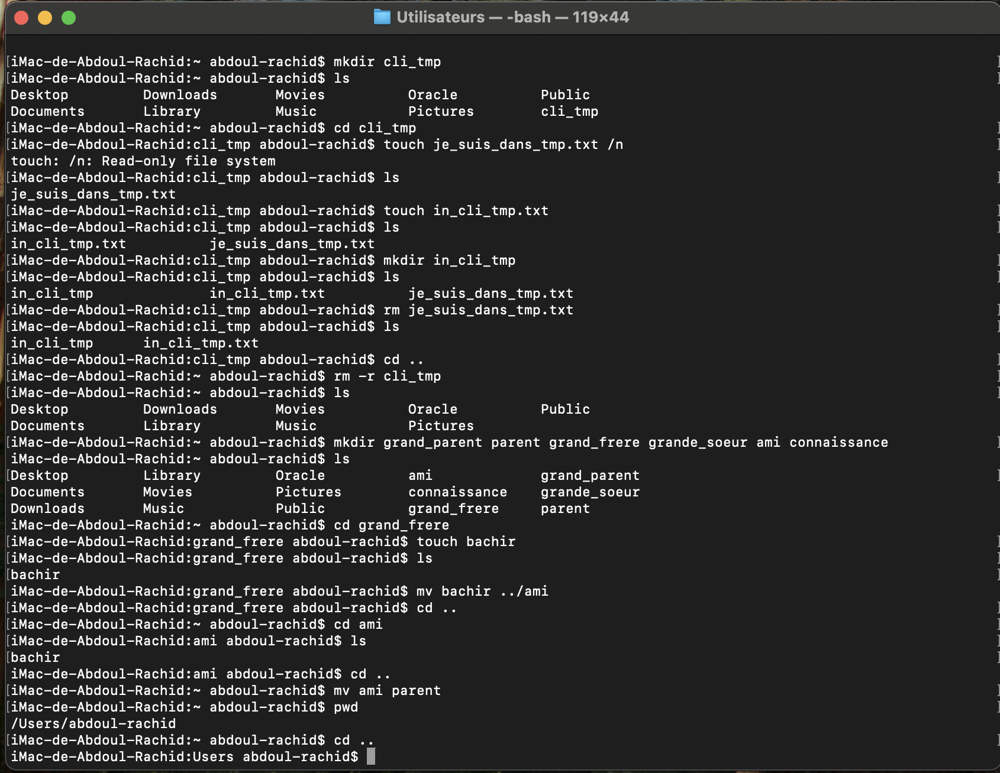

Exercice 1: Découverte des Bases CLI

Objectif : Maîtriser la navigation, création et suppression de fichiers/dossiers

Commandes utilisées:

# Création et navigation
mkdir cli_tmp : la commande "mkdir" permet de créer un nouveau dossier (cli_tmp).
cd cli_tmp : la commande "cd" permet de naviguer dans un dossier (cli_tmp).
ls : la commande "ls" liste les fichiers et dossiers présents dans le répertoire courant.

# Gestion de fichiers
touch je_suis_dans_tmp.txt : la commande "touch" crée un nouveau fichier (je_suis_dans_tmp.txt).
touch in_cli_tmp.txt : la commande "touch" crée un nouveau fichier (in_cli_tmp.txt).
rm je_suis_dans_tmp.txt : la commande "rm" supprime un fichier (je_suis_dans_tmp.txt).

# Création des dossiers en une seule commande
mkdir grand_parent parent grand_frere grande_soeur ami connaissance : la commande "mkdir" crée plusieurs dossiers en une seule fois (grand_parent, parent, grand_frere, grande_soeur, ami, connaissance).

# Déplacement de fichiers
cd grand_frere : la commande "cd" permet de naviguer dans le dossier (grand_frere).
touch bachir : la commande "touch" crée un nouveau fichier (bachir).
mv bachir ../ami : la commande "mv" déplace le fichier (bachir) vers un autre dossier (ami).

# Navigation avancée
cd .. : la commande "cd .." permet de revenir au dossier parent.
pwd : la commande "pwd" affiche le chemin complet du répertoire courant.

