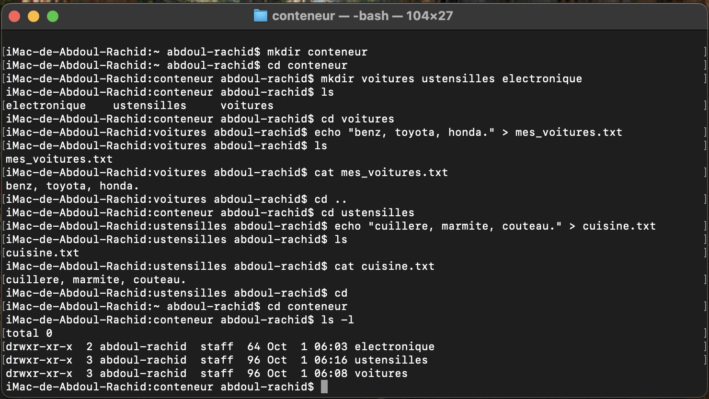

# Exercice 2 : Gestion de Contenu et Organisation

# Objectif : Apprendre à créer du contenu dans les fichiers et organiser une arborescence thématique

# Commandes utilisées:

mkdir conteneur : la commande "mkdir" crée un nouveau dossier (conteneur).

cd conteneur : la commande "cd" permet de naviguer dans un dossier (conteneur).

mkdir voitures ustensilles electronique : la commande "mkdir" crée plusieurs dossiers en une seule fois (voitures, ustensilles, electronique).

cd voitures : la commande "cd" permet de naviguer dans le dossier (voitures).

echo "benz, toyota, honda" > mes_voitures.txt : la commande "echo" permet d'écrire du texte dans un fichier (mes_voitures.txt). Le symbole ">" redirige la sortie vers le fichier, créant le fichier s'il n'existe pas ou écrasant son contenu s'il existe déjà.

cat mes_voitures.txt : la commande "cat" affiche le contenu du fichier (mes_voitures.txt).

cd ustensilles : la commande "cd" permet de naviguer dans le dossier (ustensilles).

echo "cuiellere, marmite, couteau" > cuisine.txt : la commande "echo" permet d'écrire du texte dans un fichier (cuisine.txt). Le symbole ">" redirige la sortie vers le fichier, créant le fichier s'il n'existe pas ou écrasant son contenu s'il existe déjà.

cat cuisine.txt : la commande "cat" affiche le contenu du fichier (cuisine.txt).

cd conteneur : la commande "cd" permet de revenir au dossier parent (conteneur).

ls -l conteneur : la commande "ls -l" liste les fichiers et dossiers présents dans le répertoire courant (conteneur) avec des détails supplémentaires comme les permissions, le propriétaire, la taille et la date de modification.

