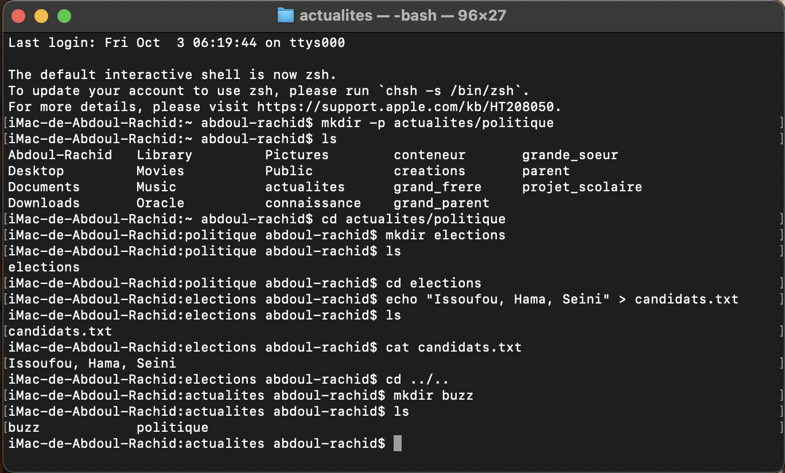

#Exercise 3 : Création Récursive et Arborescence Complexe

# Objectif : Apprendre à créer des dossiers de manière récursive et à organiser une arborescence complexe.

# Commandes utilisées:

mkdir -p actualites/politique : la commande "mkdir -p" crée un nouveau dossier (actualites) et un sous-dossier (politique) de manière récursive.

cd actualites/politique : la commande "cd" permet de naviguer dans le dossier (politique).

mkdir elections : la commande "mkdir" crée un nouveau dossier (elections).

cd elections : la commande "cd" permet de naviguer dans le dossier (elections).

echo "Issoufou, Hama, Seini" > candidats.txt : la commande "echo" permet d'écrire du texte dans un fichier (candidats.txt). Le symbole ">" redirige la sortie vers le fichier, créant le fichier s'il n'existe pas ou écrasant son contenu s'il existe déjà.

cat candidats.txt : la commande "cat" affiche le contenu du fichier (candidats.txt).

cd ../.. : la commande "cd ../.." permet de revenir au dossier grand-parent (actualites).

mkdir buzz : la commande "mkdir" crée un nouveau dossier (buzz) dans le dossier actualites.

