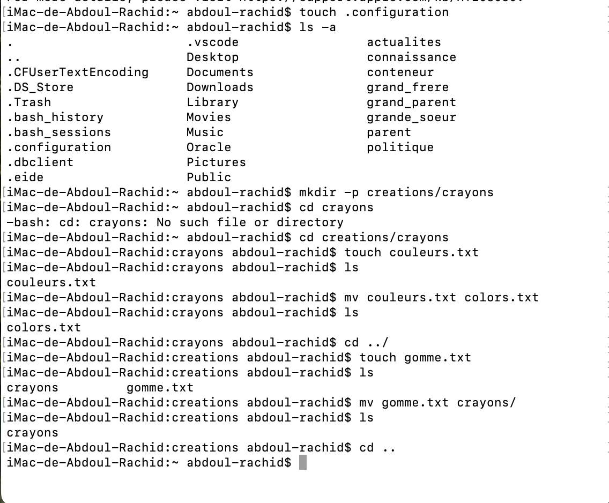

# Exercise 4 : Fichiers Cachés et Maîtrise du Renommage

# Objectif : Apprendre à gérer les fichiers cachés et perfectionner le renommage/déplacement

# Commandes utilisées:

mkdir -p creations/crayons : la commande "mkdir -p" crée un nouveau dossier (creations) et un sous-dossier (crayons) de manière récursive.

cd creations/crayons : la commande "cd" permet de naviguer dans le dossier (crayons).

touch couleurs.txt : la commande "touch" crée un nouveau fichier (couleurs.txt).

mv couleurs.txt colors.txt : la commande "mv" renomme le fichier (couleurs.txt) en (colors.txt).

cd ../ : la commande "cd ../" permet de revenir au dossier parent (creations).

touch gomme.txt : la commande "touch" crée un nouveau fichier (gomme.txt).

mv gomme.txt crayons/ : la commande "mv" déplace le fichier (gomme.txt) vers un autre dossier (crayons).

