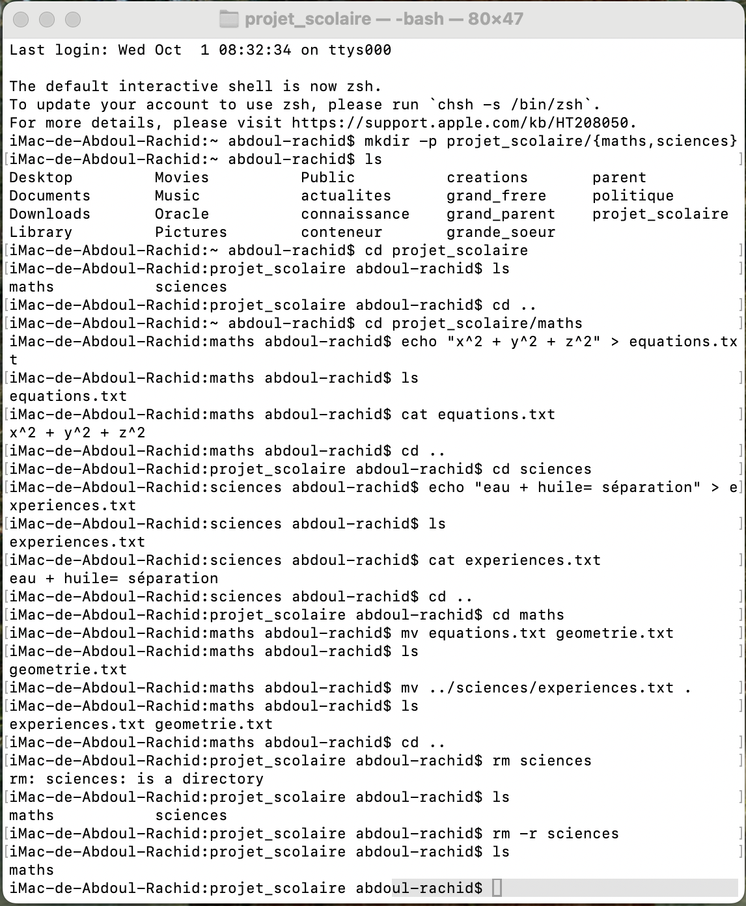

#  Exercise 5 : Expansion d'Accolades et Suppression Récursive

# Objectif : Apprendre à utiliser l'expansion d'accolades pour créer des fichiers et dossiers, et maîtriser la suppression récursive.

# Commandes utilisées:

mkdir -p projet_scolaire/{maths, sciences} : la commande "mkdir -p" crée un nouveau dossier (projet_scolaire) avec deux sous-dossiers (maths et sciences) en utilisant l'expansion d'accolades.

cd projet_scolaire : la commande "cd" permet de naviguer dans le dossier (projet_scolaire).

ls : la commande "ls" liste les fichiers et dossiers présents dans le répertoire courant (projet_scolaire).

cd projet_scolaire/maths : la commande "cd" permet de naviguer dans le dossier (maths).

echo "x^2 + y^2 + z^2" > equations.txt : la commande "echo" permet d'écrire du texte dans un fichier (equations.txt). Le symbole ">" redirige la sortie vers le fichier, créant le fichier s'il n'existe pas ou écrasant son contenu s'il existe déjà.

cat equations.txt : la commande "cat" affiche le contenu du fichier (equations.txt).

cd .. : la commande "cd .." permet de revenir au dossier parent (projet_scolaire).

cd sciences : la commande "cd" permet de naviguer dans le dossier (sciences).

echo "eau + huile = séparation" > experiences.txt : la commande "echo" permet d'écrire du texte dans un fichier (experiences.txt). Le symbole ">" redirige la sortie vers le fichier, créant le fichier s'il n'existe pas ou écrasant son contenu s'il existe déjà.

cat experiences.txt : la commande "cat" affiche le contenu du fichier (experiences.txt).

cd .. : la commande "cd .." permet de revenir au dossier parent (projet_scolaire).

cd maths : la commande "cd" permet de naviguer dans le dossier (maths).

mv equations.txt geometrie.txt : la commande "mv" renomme le fichier (equations.txt) en (geometrie.txt).

ls : la commande "ls" liste les fichiers et dossiers présents dans le répertoire courant (maths).

mv ../sciences/experiences.txt . : la commande "mv" déplace le fichier (experiences.txt) du dossier (sciences) vers le dossier courant (maths).

ls : la commande "ls" liste les fichiers et dossiers présents dans le répertoire courant (maths).

cd .. : la commande "cd .." permet de revenir au dossier parent (projet_scolaire).

rm -r sciences : la commande "rm -r" supprime de manière récursive le dossier (sciences) et tout son contenu.

ls : la commande "ls" liste les fichiers et dossiers présents dans le répertoire courant (projet_scolaire).

